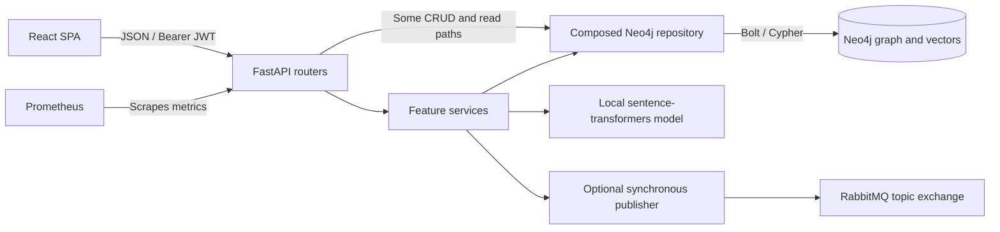
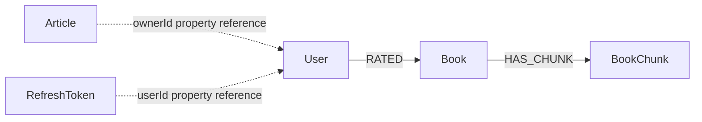

# Novelist architecture

Reviewed: 2026-10-02. Scope: the current working tree, including existing local changes. This is a source review, not a verification of a running deployment.

Novelist is a modular monolith: a React browser application calls one FastAPI application, which stores application data and semantic-search vectors in Neo4j. RabbitMQ is an optional outbound event integration. There are no event consumers, background indexing workers, or language-model generation services in this repository.

Important choices and their consequences are recorded in [Architectural decisions](ARCHITECTURAL_DECISIONS.md). Existing ADR identifiers 001–007 are retained there. The other files in `spec/` contain older design material; where they disagree, use this reviewed overview and the linked implementation for current behavior.

## Runtime and dependencies

| Boundary | Implementation and responsibility |
| --- | --- |
| Browser | React 19, TypeScript, Vite, React Router, TanStack Query, Axios. Pages and components own interaction state; Query owns fetched data. See [package manifest](../ui/package.json) and [application composition](../ui/src/App.tsx). |
| HTTP | Feature routers validate requests, authenticate callers, apply selected ownership checks, and serialize responses. Auth routes use `/auth`; business routes use `/api/v1`. |
| Use cases | Services orchestrate repository calls and selected events through feature-specific Python `Protocol` ports. Books reads and much of users CRUD call the concrete repository directly from routers. |
| Persistence | Feature repository mixins compose into one [NovelistRepository](../app/infrastructure/neo4j/repository.py). Mixins share query helpers and sometimes call one another. There are no separate feature databases. |
| Process lifecycle | [Lifespan](../app/main.py) creates one repository and publisher per application process and closes them on shutdown. Dependency factories create services per request. The repository's “request-scoped” docstring does not describe its actual lifetime. |
| External work | Neo4j queries, RabbitMQ publishing, and embeddings are synchronous. Indexing completes within the HTTP request. |

The [Dockerfile](../Dockerfile) runs Python 3.13 and one Uvicorn process as a non-root user. It caches the default embedding model during image construction. [Compose](../docker-compose.yml) defines API, Neo4j 5.15.0, RabbitMQ, Prometheus, and Grafana services with persistent data volumes. The UI runs separately; a production UI hosting arrangement is not supplied.

## Feature boundaries

| Module | Main behavior |
| --- | --- |
| `auth` | Registration, bcrypt password verification, access/refresh JWT issuance, persisted refresh-token revocation. |
| `books` | Shared catalog CRUD, case-insensitive substring search, filters, offset pagination, optional rating aggregation. |
| `users` / `profile` | User CRUD, JSON-encoded preferences, current-user profile and rating history. |
| `articles` | Owner-only versioned drafts, explicit published snapshots, public story feeds and safe author projections. See [publishing](ARTICLE_PUBLISHING.md). |
| `ratings` | Upsert a user's rating/review for a book; book reviews and paginated current-user rated books. |
| `analytics` | Query-time rating averages/counts, trending ordered by count × average, book counts per genre. |
| `recommendations` | Traverse users who share highly rated books; rank unseen books by matching path count. No trained recommendation model or cold-start fallback. |
| `rag` | Explicitly chunk and embed stored book content; retrieve similar chunks with Neo4j cosine vector search. Despite the module name, there is no generated answer or conversational memory on the server. |

## Persisted model

- `User`: UUID `userId`, identity fields, `passwordHash` for registered accounts, timestamps, and `preferencesJson`. Preferences are decoded to an object for API responses.
- `Article`: UUID ID, owner ID, JSON draft/public snapshots, revision counters and timestamps.
- `Book`: UUID `bookId`, metadata, genres, cover URL, full `content`, and timestamps.
- `RATED`: rating, optional review, initial timestamp, and helpful count. `MERGE` updates the existing relationship for the user/book pair; changing a rating preserves its initial timestamp.
- `BookChunk`: book ID, chunk ordinal, text, and embedding vector. Chunks link from the book through `HAS_CHUNK`.
- `RefreshToken`: `jti`, user ID, expiry, revocation flag, and creation time. This node has no relationship to `User` and is not removed by user deletion.

Source: feature [repositories](../app/modules) and [shared query helpers](../app/infrastructure/neo4j/base.py). Application code creates the RAG vector index and lazily installs the article ID uniqueness constraint before the first article write. The constraints and ordinary indexes shown in the older database specification are not automatically installed by startup or Compose. Email/ISBN checks are separate read-before-write queries, so they do not ensure uniqueness under concurrent requests.

## Main request flows

**Book write:** bearer authentication → Pydantic validation → `BookService` → Neo4j mutation → synchronous event publish → response. Only `book.created`, `book.updated`, `book.deleted`, and `rating.added` are emitted. There is no database/message transaction; a successful database change can have no corresponding event.

**Authentication:** login verifies `passwordHash`, persists refresh-token metadata, and returns both JWTs. Access-token verification checks signature, expiry, and token type without looking up the user. Refresh checks the JWT and stored revocation flag and issues another access token without rotating the refresh token. Logout revokes the submitted refresh token; existing access tokens remain valid until expiry. The browser stores tokens in `localStorage` and redirects to login on 401; it does not automatically refresh them.

**Semantic indexing/search:** `/rag/index` loads a book, lazily loads the local embedding model and creates the vector index if needed, splits content into overlapping character chunks, embeds them, then replaces stored chunks. `/rag/search` embeds the query and returns scored chunks with current book metadata. Book creation/update does not automatically index content. Chunk deletion and insertion are separate database operations.

## API and operational contracts

[APIModel](../app/modules/shared/schemas.py) maps snake_case Python fields to camelCase JSON and accepts field names as input. Auth token schemas use snake_case. Collection responses use a shared page envelope with zero-based pages and sizes of 1–100; the legacy envelope has `content: list[Any]`. Articles instead use a typed summary page to filter content explicitly. Validation errors return 400, repository not-found/conflict errors return 404/409, and `HTTPException` uses FastAPI's separate `detail` envelope.

Configuration uses cached Pydantic settings loaded from environment and `.env`; CORS accepts a string parsed as comma-separated values or a JSON array. The frontend API origin is currently hard-coded to `http://localhost:8081` in [client.ts](../ui/src/api/client.ts).

Startup logs and tolerates Neo4j connectivity failure. `/actuator/health` checks Neo4j and returns 503 on failure; it does not verify RabbitMQ, the embedding model, or vector-index readiness. Prometheus scrapes HTTP instrumentation at `/actuator/prometheus`. Structlog configures JSON output outside DEBUG. SlowAPI uses IP-based limits with its default in-memory storage. These are process-local controls, not shared limits across replicas.

## Review findings and follow-up priorities

These are findings and suggested follow-ups, not implemented changes or approved future decisions.

| Priority | Finding and effect | Follow-up |
| --- | --- | --- |
| High | User list/search returns repository dictionaries through `PageOut.content: list[Any]`. `_user_out` retains `passwordHash`, so registered users' hashes can be returned to any authenticated caller. | Apply explicit safe user serialization to every response path and add a regression test with real-shaped repository data. |
| High | Legacy user/book identity constraints are not installed; concurrent email/ISBN checks can both pass. Article IDs have a separate uniqueness constraint. | Introduce versioned schema setup and database-enforced identity rules, including a consistent email normalization policy. |
| High | A process-wide `pika.BlockingConnection`/channel is reused from synchronous request handlers without thread ownership or serialization. | Establish a dedicated publisher execution context or other concurrency-safe adapter; test concurrent writes and reconnects. |
| Medium | Event publishing follows committed writes, has no outbox/confirm protocol, and may delay HTTP requests during connection attempts. | Keep events explicitly best effort, or adopt an outbox and delivery policy if consumers become correctness-critical. |
| Medium | Chunk replacement is non-atomic; content edits leave stale vectors, and deleting a book leaves orphan chunk nodes. Orphans can occupy vector top-k slots before the query joins back to books. | Define an atomic indexing lifecycle, invalidation, and cascading cleanup; test failure and deletion cases. |
| Medium | JWT validation does not check whether a user still exists; deletion does not revoke refresh-token nodes. Browser logout does not clear the shared Query cache. | Define account deletion/session invalidation semantics and clear or partition user-specific browser caches. |
| Medium | All authenticated callers can modify/delete shared books and index content; ownership checks apply only to selected user mutations and rating writes. | Confirm that shared-catalog editing is intended before exposing the service to untrusted users. |
| Medium | Compose requires RabbitMQ even though publishing is optional, and its API healthcheck invokes `wget`, which the Dockerfile does not install. | Align deployment dependencies with the optional-broker policy and provide a healthcheck executable guaranteed to exist in the image. |

## Evidence and verification limits

The review traces entrypoints, dependency wiring, services, repositories, UI auth/cache behavior, and deployment configuration. [Service unit tests](../tests/unit/test_services.py) use stubs. The API suites in [test_api_integration.py](../tests/test_api_integration.py) and [test_api_coverage.py](../tests/test_api_coverage.py) replace repositories/publishers; RAG tests also mock the service. These tests check application contracts but do not establish real Cypher correctness, broker reliability, embedding/index compatibility, or container readiness. No live infrastructure verification was performed for this documentation update.
